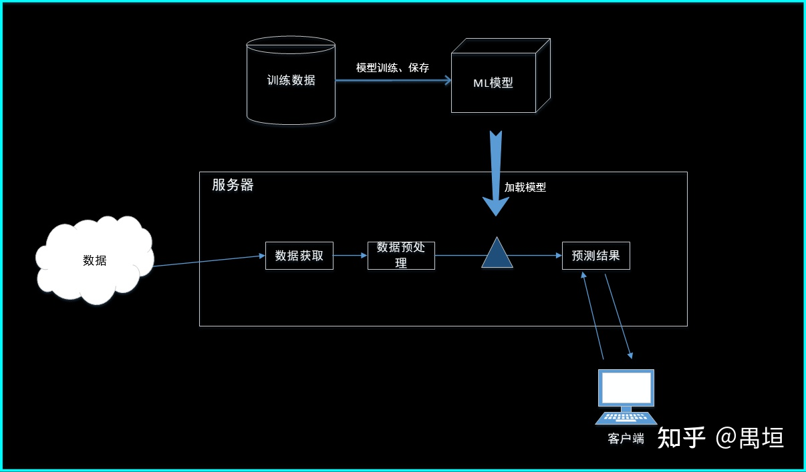
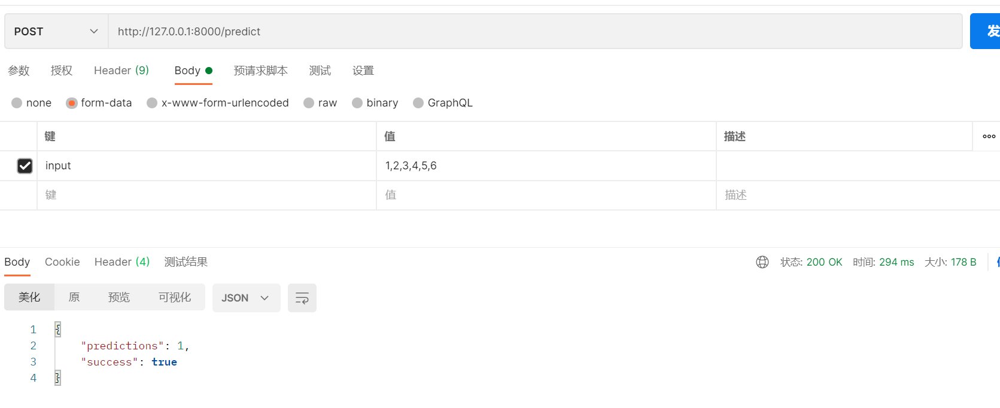

# 基于Flask框架部署tensorflow模型
+ 部署框架图
  
+ 参考教程
    + https://zhuanlan.zhihu.com/p/83894642
    + https://zhuanlan.zhihu.com/p/348486665
    + https://www.cnblogs.com/yanqiang/p/13535161.html
+ 项目介绍
  + 3个函数
    + main.py：用于训练深度学习模型，并利用tr.train.Saver保存模型（默认保存全部参数）
      + checkpoint：检查点，记录保存了哪些checkpoint
      + .data-xxxx：以字典形式保存权重偏置等训练参数
      + .index：参数索引
      + .meta：图结构及图中参数数据
    + server.py：利用flaskk框架来部署模型服务
      + tf.train.Saver：用来加载存储在data中的权重和偏置项等需要训练的参数，其他不加载 
        + 必须保证这些参数的shape、type相同：用于手动重新搭建网络，加载.data-xxxx中数据
      + tf.train.import_meta_graph：用来加载meta文件中的图，及图上定义的节点参数，包括权重偏置项等需要训练的参数，训练过程中间生成的参数
        + get_tensor_by_name(name="训练时的参数名")：获取参数
    + test.py：调用模型服务进行预测
  + 测试方法
    + 第一步，运行main.py生成上述4个文件
    + 第二步，运行server.py部署服务
    + 第三步，两种方式：
      + 直接在test.py中完成数据处理过程，并运行test.py调用服务获得结果
      + 利用postman发送post请求获取模型返回值
  
